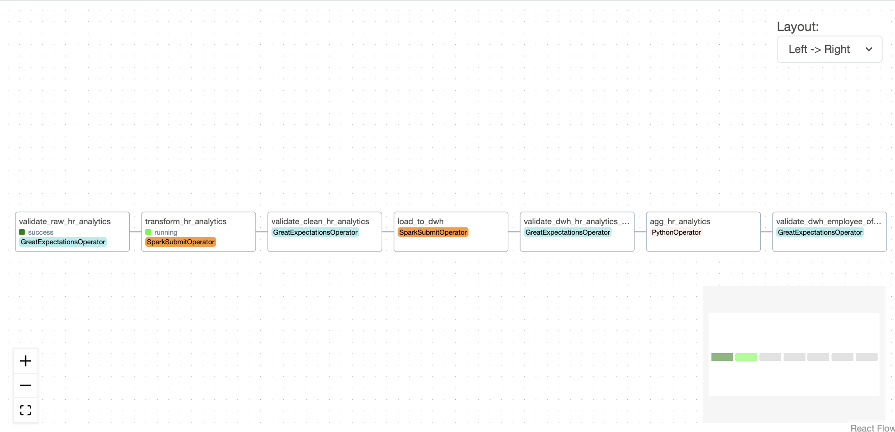
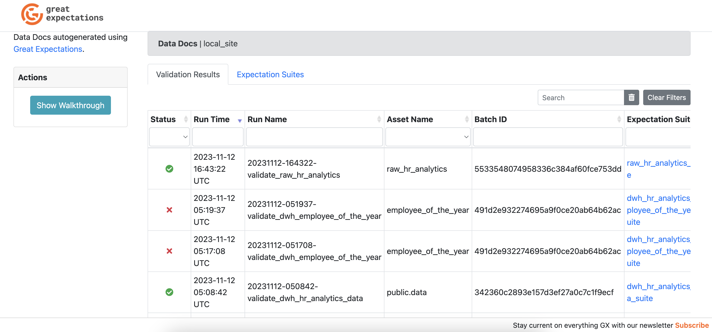

# Great Expectations Research

Table of Contents:

1. [Reference links](#1-reference-links)
2. [Deployment](#2-deployment)
3. [Operations](#3-operations)

## 1. Reference links
- [Official website](https://greatexpectations.io/integrations/)
- [Github](https://github.com/great-expectations/great_expectations)
- [Orchestrate Great Expectations with Airflow](https://docs.astronomer.io/learn/airflow-great-expectations)
- [DataHubValidationAction](https://datahubproject.io/docs/metadata-ingestion/integration_docs/great-expectations/)
- [Expectations Gallery](https://greatexpectations.io/expectations/)

## 2. Deployment
- Run following commands to start Airflow and related components:
    ```bash
    # Build docker image
    bash build/build.sh
    # Start Airflow
    cd build
    docker-compose up
    ```

## 3. Operations
- Airflow Web: http://localhost:9120/ <br>
    

- Great Expectations Data Docs: http://localhost:9117/ <br>
    
